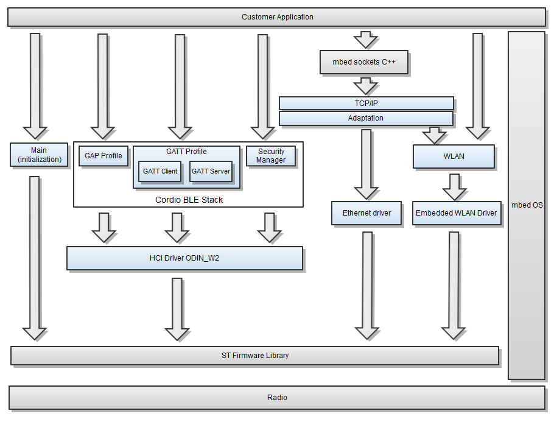
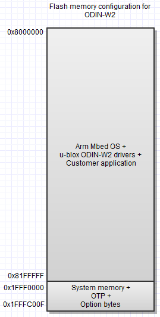

*Please note this repository is no longer maintained by u-blox.*

# u-blox ODIN-W2 Wi-Fi and Bluetooth drivers

This is a pre-compiled binary module including u-blox Wi-Fi and BLE hci drivers for [Arm Mbed OS](https://mbed.com).

The binary is intended for and can only be run on a u-blox ODIN-W2 module.

Please note that this document is not intended as a complete system description. It is intended to be an overview and for details the header files must be used.

There are two levels of the API, one C++ API and one lower level C API for WIFI. It is highly recommended to use the C++ interface as this is the intended way Arm Mbed should be used. The C API is provided to be able to support the Mbed C++ classes and might be used by the application until such classes exist. Currently there is support for the Wi-Fi station and access point  via the OdinWiFiInterface class.

If the C API is used please note that this interface is subject to change and it is highly recommended to migrate to the C++ API once it is available. The C API is considered as experimental.

Cordio BLE stack by Arm is supported and it provides C++ API. For details see [Cordio BLE](https://os.mbed.com/docs/latest/apis/ble.html).

## Related documents
[https://www.u-blox.com/sites/default/files/ODIN-W2_DataSheet_%28UBX-14039949%29.pdf](https://www.u-blox.com/sites/default/files/ODIN-W2_DataSheet_%28UBX-14039949%29.pdf) - ODIN-W2 Data Sheet  

## Overview

The ODIN-W2 module supports a variety of interfaces such as WLAN, BLE(Bluetooth low energy), RMII (Ethernet), SPI, UART, CAN, I2C, GPIOs, Analog input pins, and JTAG/SWD. Many of the interfaces and IO pins are multiplexed. For details see the [ODIN-W2 Data Sheet](https://www.u-blox.com/sites/default/files/ODIN-W2_DataSheet_%28UBX-14039949%29.pdf).

The embedded WLAN driver is optimized for small embedded industrial systems with high requirements on performance and robustness. The Wi-Fi driver contains station as well as access point. A supplicant is also included.

Cordio BLE stack contains GAP profiles, GATT profiles, and security manager services. GATT profile allows both client and server role for device. A list of supported GATT services is provided [here](https://os.mbed.com/teams/Bluetooth-Low-Energy/wiki/BLE-services-supported-on-mbed).

The drivers for the C API are not thread safe. This means that all calls to and from the drivers must be serialized to ensure that there are never more than one concurrent entry point called in the drivers. This can be achieved by posting function calls to the driver thread with 'cbMAIN_getEventQueue()->call()'. It's also possible to use the driver lock 'cbMAIN_driverLock()' to ensure mutual exclusion before any call to the drivers. 'cbMAIN_driverUnlock()' must be called after the function to release the driver thread lock.
Notes:
- The application entry point 'main()' does not run in the same context as the driver.
- The OdinWiFiInterface class is already protected by the cbMAIN driver lock so these locks should not be used for this interface.
- Callbacks for the Wi-Fi C API is not re-entrant which means you need to defer any function calls inside the callbacks.

The exported components and corresponding files in the u-blox ODIN-W2 driver is shortly described below.

### Common
- **Main**(cb\_main.h) - Initialization of Wi-Fi and Bluetooth
- cb\_comdefs.h - Commonly used definitions like TRUE/FALSE
- cb\_status.h - Common status codes
- cb\_watchdog.h - Hardware watchdog
- cb\_otp.h - Read One-Time Programmable(OTP) parameters like MAC addresses. 

### Bluetooth Low Energy
For more info about the Bluetooth Low Energy components see https://os.mbed.com/teams/Bluetooth-Low-Energy/.

### Wi-Fi
- **OdinWiFiInterface.h** - C++ interface
- cb\_wlan.h - C API for scanning, connection setup, maintenance and termination
- cb\_wlan\_types.h - WLAN types
- cb\_wlan\_target\_data.h - WLAN target that handles packetization of Ethernet frames
- cb\_platform\_basic\_types.h - Common definitions for a GCC compatible compiler
- cb\_port\_types.h - WLAN types
- cb\_types.h - Common types

Note that either the C API or the C++ API can be used in an application. They should not be mixed in an application.

The access point interface is not natively supported in mbed-os EMAC interface. However support for it is ongoing.

For more info about the Wi-Fi component look [here](documentation/readme_wifi.md).

### TCP/IP stack
The IP stack used is provided by mbed-os and is accessible from the socket API.

### mbed OS
This is the Arm Mbed OS framework and is a collection of OS-related modules and includes the control of GPIOs, UART, SPI, I2C, security etc. A thorough description can be found [here](https://os.mbed.com/docs/latest/introduction/index.html)

### ST firmware library
A subset of the functionality provided by the ST firmware library is accessible from Mbed OS. If more control is needed it's also possible to access the drivers directly via the mbed-os lower layers. Note that it must be used with care since any misuse might break the driver and/or Mbed OS.

## Qualification and approvals
Arm Cordio stack is qualified. For more details see [here](https://launchstudio.bluetooth.com/ListingDetails/126).

## Flash memory configuration

How much space the Arm Mbed OS and ODIN-W2 drivers occupy is very dependent on how much functionality is used. Typically around 1.5MByte when Wi-Fi and BLE drivers are being used. 

No boot, starting at address 0, is used in this flash configuration as this is typically overwritten when using the ST-LINK mass storage flashing on the EVK-ODIN-W2.

**NOTE 3: The One Time Programmable(OTP) area is reserved for the ODIN-W2 drivers and must not be written to. The OTP area keeps all the MAC addresses.**

## RAM
The ODIN-W2 drivers use both static RAM and dynamically allocated heap memory via the Mbed OS heap. The heap usage is heavily dependent on the use case.

## Hardware watchdog
The hardware watchdog is neither initialized nor enabled by default but can be added via the cb_watchdog.h API.

## Power management
TBA

## Hardware resources
Both the Bluetooth stack and the Wi-Fi driver use parts of the hardware. The table below shows the dependencies to those resources.

| HW resource           | Component          | Description                                                                                                        |
|-----------------------|--------------------|--------------------------------------------------------------------------------------------------------------------|
| GPIO                  | ODIN-W2            | Only IO pins that are included in the ODIN-W2 target can be used.                                                  |
| System tick interrupt | ODIN-W2 timers/HAL | The system tick is used by the ODIN-W2 internal timer component and also by the ST firmware lib.                   |
| TIM5                  | us_ticker          | Timer used by Mbed OS                                                                     |
| TIM3                  | ODIN-W2            | Used by the Bluetooth HCI UART                                                                                     |
| DMA5, DMA6            | ODIN-W2            | DMA stream 5 and 6 are reserved to be used by BLE HCI UART                                                              |
| USART6                | ODIN-W2            | Used by the Bluetooth HCI UART                                                                                     |
| IWDG                  | ODIN-W2            | The independent watchdog is setup using cbWD. Disabled by default. Can be emitted by not initializing the component. |
| Ethernet              | ODIN-W2            | Handled by Mbed OS                                                                                                 |
| SDIO                  | ODIN-W2            | Used by the Wi-Fi driver                                                                                           |
| Flash memory          | ODIN-W2            | Bluetooth link keys are stored in the last two sectors. OTP is reserved for the ODIN-W2 drivers.                   |
